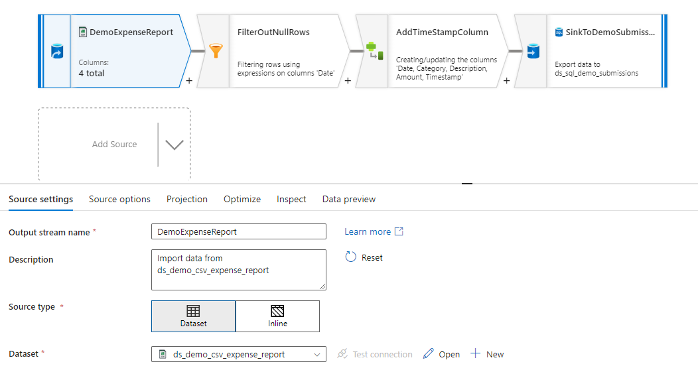
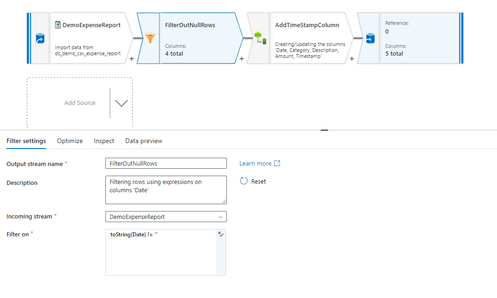
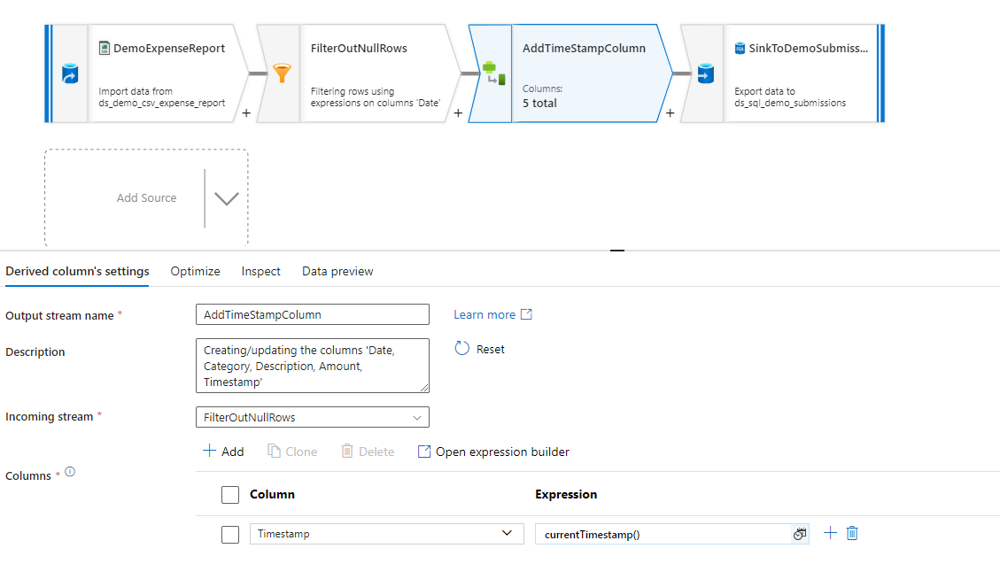
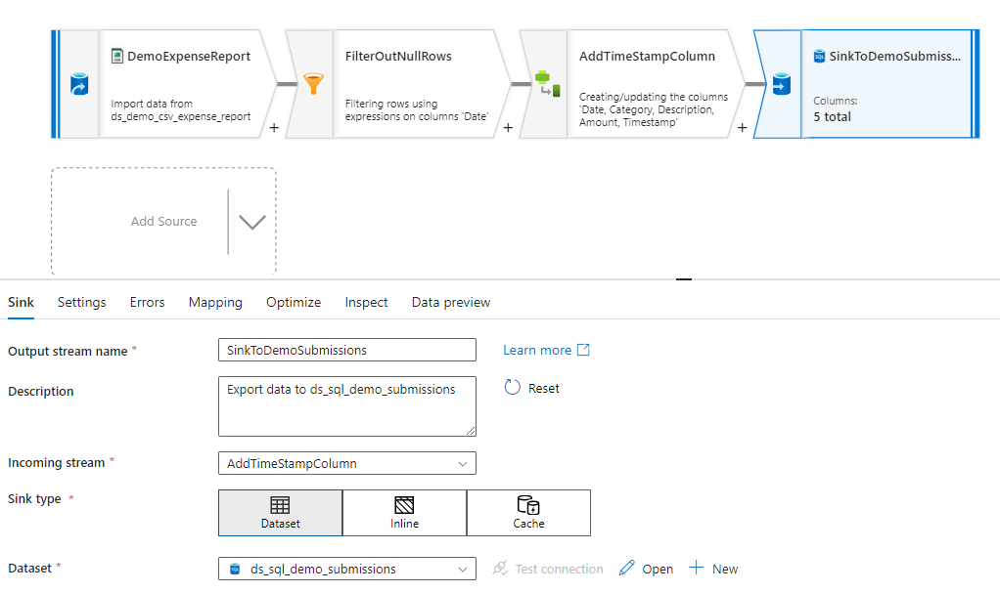

# Routing Expense Report Data to Azure SQL using Azure Data Factory

### **Summary:**
This repository provides a preview of an automated workflow for managing expense reports using Azure services. When a user uploads an **'Expense Report' CSV** file to an Azure Data Lake Gen2 account, it triggers a storage event. Subsequently, an Azure Data Factory (ADF) pipeline is initiated to execute Extract, Transform, Load (ETL) operations on the data. The transformed data is then seamlessly deposited into Azure SQL for further analysis and processing. This end-to-end process streamlines expense report management and enhances data accessibility and analysis capabilities.


## Overview of ADF pipeline leveraging Data Flow
In this demonstration, I leverage Data Flow to implement a four-step process for managing the expense report workflow:

#### **1. Source: This step retrieves the data from the uploaded expense report CSV file:**


#### **2. Filter: Data is filtered based on specified criteria to ensure accuracy and relevance:**


#### **3. Derived Column: Additional columns are derived or modified to meet specific requirements or calculations:**


#### **4. Sink: The processed data is seamlessly deposited into Azure SQL for further analysis and processing:**



## Utilizing SQL for Expense Report Demo
So, the following SQL snippets are utilized to assist us with setting up the following in Azure SQL:

### Schema Creation:
```sql
IF NOT EXISTS (
    SELECT 1
    FROM sys.schemas
    WHERE name = 'expense_reporting'
)
BEGIN
    EXEC('CREATE SCHEMA expense_reporting;');
    PRINT 'Schema expense_reporting created successfully.';
END
ELSE
BEGIN
    PRINT 'Schema expense_reporting already exists.';
END
```


### Table Creation:
```sql
IF NOT EXISTS (
    SELECT 1
    FROM INFORMATION_SCHEMA.TABLES
    WHERE TABLE_SCHEMA = 'expense_reporting'
    AND TABLE_NAME = 'demo_submissions'
)
BEGIN
    CREATE TABLE expense_reporting.demo_submissions
    (
        [Transaction Date]          DATE NOT NULL,
        [Category]                  VARCHAR(30),
        [Expense Description]       VARCHAR(100),
        [Amount]                    MONEY,
        [Custom Timestamp]          DATETIME DEFAULT GETDATE()
    );
    PRINT 'Table expense_reporting.demo_submissions created successfully.';
END
ELSE
BEGIN
    PRINT 'Table expense_reporting.demo_submissions already exists.';
END
```


### Querying Data from Demo Submissions tbl:
```sql
SELECT *
FROM expense_reporting.demo_submissions
ORDER BY [Transaction Date] DESC;
```


### Creating Expense Demo View:
```sql
IF NOT EXISTS (SELECT * FROM sys.views WHERE name = 'ExpenseDemoView')
BEGIN
    EXEC('
    CREATE VIEW ExpenseDemoView AS
    SELECT 
        [Transaction Date] AS transaction_date,
        [Category],
        [Expense Description] AS expense_description,
        [Amount],
        FORMAT(SWITCHOFFSET([Custom Timestamp], ''-06:00''), ''yyyy-MM-dd hh:mm:ss tt'') AS last_modified_cst
    FROM 
        expense_reporting.demo_submissions;
    ');
    PRINT 'ExpenseDemoView created successfully.';
END
ELSE
BEGIN
    PRINT 'ExpenseDemoView already exists.';
END
```